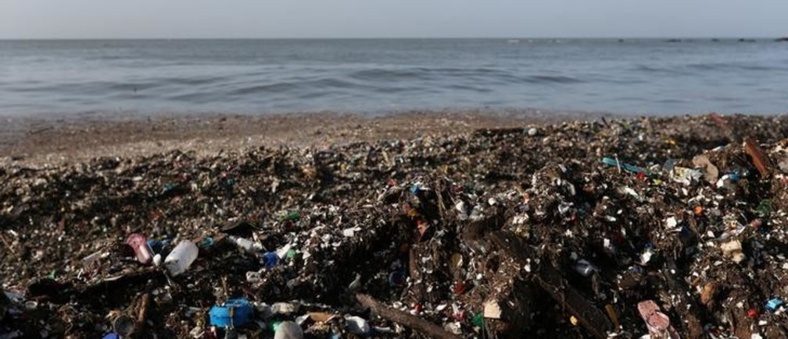

---
output:
  xaringan::moon_reader:
    lib_dir: libs
    nature:
      highlightStyle: github
      highlightLines: true
      countIncrementalSlides: false
---

```{r setup, include=FALSE}
knitr::opts_chunk$set(echo = TRUE)
#install.packages("xaringan")
#install.packages("devtools")
#devtools::install_github('yihui/xaringan')
```

class: inverse, center, middle

# Global Plastic Waste

#### Kamlesh Singh, Neha Ayuluri, and Vishnu Vardhan Rao Madamanchi
###### Original Dataset on tidyTuesday by Thomas_Mock on [Github](https://github.com/rfordatascience/tidytuesday/tree/master/data/2019/2019-05-21)
###### Link to our [Github](https://github.com/kamsingh11/datascience/tree/master)
##### 
##### October 28th 2019
---
class: inverse, center, middle
#Why Global Plastic Waste?
--

####Negative Effect on Global Environment including Oceans and wildlife Health 

.footnote[
[1] [World's Plastic Problem](https://www.weforum.org/agenda/2018/08/the-world-of-plastics-in-numbers)]

---
class: inverse, center, middle
#Dataset & TidyTuesday Selection
#### Original Code and Visualization credit goes to **_Lainey Johnson_**  on [Github](https://github.com/LaineyJ/TidyTuesdays/blob/master/2019-05-21/Global%20Plastic%20Waste.R):


---
class: inverse, center, middle
###### "Coast vs Waste" dataset


###### "mismanaged vs gdp" dataset


###### "Waste vs Gdp" dataset

---

class: inverse, center, middle
##Review of Lainey Johnson’s #tidytuesday post 

---


# <center> Lainey's Visualization </center>
---
class: inverse, center, middle
#SUGGESTED DESIGN
---
class: inverse, center, middle
###Mismanaged Plastic Waste vs Coastal Population (2010)

###Graph is modified to show trend across mismanaged waste in various continents
##### Reference: [Healy Chapter 6](http://socviz.co/modeling.html)

---
class: inverse, center, middle

#Mismanaged Plastic Waste vs GDP per capita (2010)

### The continents which have higher GDP are good at managing plastic waste
---
class: inverse, center, middle

###Mismanaged Plastic Waste vs Continent (PPPD)

##### Reference: [Wilke Chapter 9](https://serialmentor.com/dataviz/boxplots-violins.html)
---
class: inverse, center, middle

###Mismanaged Plastic Waste vs Continent (PPPD)

##### Reference: [Wilke Chapter 9](https://serialmentor.com/dataviz/boxplots-violins.html)
---
class: inverse, center, middle

###Mismanaged Plastic Waste vs Continent (PPPD)

##### Reference: [Wilke Chapter 9](https://serialmentor.com/dataviz/boxplots-violins.html)
---
class: inverse, center, middle

###Mismanaged Plastic Waste vs Continent (PPPD)

##### Reference: [Wilke Chapter 9](https://serialmentor.com/dataviz/boxplots-violins.html)
---
class: inverse, center, middle

###Mismanaged Plastic Waste vs Continent (PPPD)

##### Reference: [Wilke Chapter 9](https://serialmentor.com/dataviz/boxplots-violins.html)
---

class: inverse, center, middle

###Continent vs Coastal Population Proportion 

##### Reference: [Wilke Chapter 9](https://serialmentor.com/dataviz/boxplots-violins.html)
---
class: inverse, center, middle

###Continent vs Coastal Population Proportion 

##### Reference: [Wilke Chapter 9](https://serialmentor.com/dataviz/boxplots-violins.html)
---
class: inverse, center, middle

#Continent vs Coastal Proportion

##### Reference: [Wilke Chapter 9](https://serialmentor.com/dataviz/boxplots-violins.html)
---
class: inverse, center, middle

#Continent vs Coastal Population Proportion

##### Reference: [Wilke Chapter 9](https://serialmentor.com/dataviz/boxplots-violins.html)
---
class: inverse, center, middle
#RECOMMENDED DESIGN
---
class: inverse, center, middle

#Plastic Produced in All Years

##### Reference: [Wilke Chapter 13](https://serialmentor.com/dataviz/time-series.html)
---
class: inverse, center, middle

#Plastic Waste Generation in 2010

---

class: inverse, center, middle

#Plastic Waste produced in 2010

##### Reference: [Wilke Chapter 15](https://serialmentor.com/dataviz/geospatial-data.html#choropleth-mapping)
---

class: inverse, center, middle

#Plastic Waste Generation per person 2010

---

class: inverse, center, middle

###Plastic Waste Generation per person per day 2010

##### Reference: [Wilke Chapter 15](https://serialmentor.com/dataviz/geospatial-data.html#choropleth-mapping)
---
class: inverse, center, middle

###Share of Plastic Waste Inadequately Managed 2010

##### Reference: [Wilke Chapter 15](https://serialmentor.com/dataviz/geospatial-data.html#choropleth-mapping)
---
class: inverse, center, middle

###Share of Plastic Waste Inadequately Managed 2010

---
class: inverse, center, middle

#Storyboard

---
#Conclusion

--

- Annual production of plastics increased nearly 200-fold to 381 million tonnes in 2015 

--

- High-income countries generate more plastic waste per person

--

- Poor waste management across many middle- and low-income countries

--

- Improvement of waste management systems across the world to reduce plastic pollution

--

- Looking forward to make it interactive using Shiny to focus on country level detail

.footnote[
[1] [Plastic Pollution](https://ourworldindata.org/plastic-pollution)]

